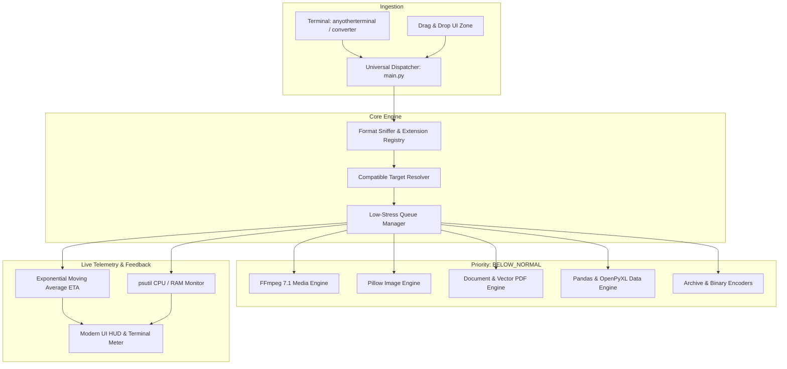

<div align="center">

# 🔮 OmniConvert
### *The Universal High-Fidelity File Converter for the Modern Era.*

[](https://www.python.org/)
[](https://www.riverbankcomputing.com/software/pyqt/)
[](https://ffmpeg.org/)
[](#-the-zero-stress-philosophy)
[](LICENSE)

<br/>

> *"In an era where simple utilities are bloated with 500MB web-runtimes, grinding CPUs to a halt and spinning cooling fans to jet-engine decibels... OmniConvert was forged with a singular mandate: Absolute fidelity, zero hardware strain, and instantaneous terminal invocation from anywhere."*

<br/>

[Key Features](#-the-seven-pillars-of-omniconvert) •
[Conversion Matrix](#-the-universal-format-matrix) •
[Zero-Stress Engine](#-the-zero-stress-philosophy) •
[Terminal Magic](#-instant-terminal-launch) •
[Quickstart](#-quickstart-guide) •
[Architecture](#-architectural-blueprint)

---

</div>

## 🌌 The Seven Pillars of OmniConvert

| # | Pillar | Description |
|---|---|---|
| **I** | **Universal Matrix** | Seamlessly converts across **Video, Audio, Images, Documents, Spreadsheets, Archives, and Binary Streams**. |
| **II** | **Zero-Stress Engine** | Conversion workers run on **`BELOW_NORMAL_PRIORITY_CLASS`** with adaptive CPU thread capping. Your PC never stutters, drops frames, or overheats. |
| **III** | **Mathematical EMA ETA** | No illusory progress bars. An Exponential Moving Average (EMA) algorithm calculates true throughput (`MB/s`, `fps`) and accurate **Estimated Time of Arrival (ETA)**. |
| **IV** | **Absolute Fidelity** | Lossless container stream-copying, uncompressed WAV/FLAC audio, lossless WebP/PNG/TIFF, and complete EXIF & ICC profile preservation. |
| **V** | **Dark Glassmorphic UI** | Crafted with native **PyQt6**, featuring sleek dark obsidian palettes (`#0B0E14`), translucent frosted cards, and glowing interactive drag-and-drop zones. |
| **VI** | **Terminal Ubiquity** | Execute `anyotherterminal -converter` or `converter` from **any directory** in PowerShell, Command Prompt, Windows Terminal, Git Bash, or the Run Dialog. |
| **VII** | **Live Telemetry Cockpit** | Real-time cockpit displaying system & process CPU %, memory consumption in MB, and hardware safety telemetry. |

---

## 🚀 Instant Terminal Launch

OmniConvert installs native Windows execution wrappers directly into your user's `PATH`. No manual configuration or administrator privileges required.

```powershell
# Launch the full modern GUI from ANY terminal window
anyotherterminal -converter

# Or simply:
converter

# Preload files directly into the GUI queue:
converter photo.png interview.wav dataset.csv report.docx

# Perform lightning-fast, headless CLI conversions:
converter -i video.mp4 -f mp3 --lossless
converter -i ledger.csv -f xlsx
converter -i screenshot.png -f webp --power eco
```

---

## 🛡️ The Zero-Stress Philosophy

Most converters greedily spawn threads that claim 100% of your CPU and GPU cores, causing system freezing, audio crackling, and high thermal strain.

**OmniConvert changes the paradigm:**

```
                    ┌─────────────────────────────────────────┐
                    │       OmniConvert Priority Governor      │
                    └───────────────────┬─────────────────────┘
                                        │
             ┌──────────────────────────┼──────────────────────────┐
             ▼                          ▼                          ▼
    🌿 Eco Mode (1 Core)       ⚖️ Balanced (2 Cores)      ⚡ Turbo (Adaptive)
  - Process: IDLE Priority    - Process: BELOW_NORMAL    - Process: NORMAL
  - I/O: Throttled chunks     - I/O: Smooth streaming    - I/O: Maximum throughput
  - Zero heat / Silent fan    - Ideal for multitasking   - Fast batch exports
```

1. **Operating System Priority Suspension**: Subprocesses (including FFmpeg) and background worker pools are pinned to `BELOW_NORMAL_PRIORITY_CLASS`. Your OS always prioritizes your active work, browser, and games.
2. **Chunked Memory Streaming**: 64 KB streamed buffers prevent multi-gigabyte file reads from consuming your physical RAM.
3. **Adaptive Threading**: Never maxes out core pools unless explicitly instructed in Turbo mode.

---

## 📊 The Universal Format Matrix

<details open>
<summary><b>🎬 Multimedia (Video & Audio) — Powered by FFmpeg v7.1</b></summary>
<br/>

| Category | Formats Supported | Fidelity Highlights |
|---|---|---|
| **Video ➔ Video** | `MP4`, `MKV`, `WEBM`, `AVI`, `MOV`, `FLV`, `WMV`, `M4V`, `TS`, `GIF` | High-profile H.264/H.265 (CRF 18/lossless), VP9, and direct container stream-copy (`-c copy`) for 0% CPU loss-free remuxing. |
| **Audio ➔ Audio** | `MP3`, `WAV`, `FLAC`, `AAC`, `OGG`, `M4A`, `OPUS`, `WMA`, `AIFF`, `ALAC` | Pristine 320kbps MP3, uncompressed PCM 16/24-bit WAV/AIFF, bit-perfect FLAC, and high-bitrate AAC. |
| **Video ➔ Audio** | Any video ➔ `MP3`, `WAV`, `FLAC`, `AAC`, `M4A`, `OGG` | Instant audio stream extraction without video decode overhead. |

</details>

<details open>
<summary><b>🖼️ Images — Powered by Pillow Engine</b></summary>
<br/>

| Formats | Supported Conversions | Quality Options |
|---|---|---|
| `PNG`, `WEBP`, `JPG/JPEG`, `BMP`, `TIFF`, `ICO`, `GIF`, `PPM`, `TGA`, `PDF` | Any-to-Any image conversion | True Lossless WebP (`quality=100`), uncompressed TIFF/BMP, 100% Quality JPEG with 4:4:4 chroma, multi-page image PDF builder, and smart alpha-channel compositing. |

</details>

<details open>
<summary><b>📄 Documents, Text & Code</b></summary>
<br/>

| Formats | Supported Conversions | Engine Details |
|---|---|---|
| `PDF`, `DOCX`, `TXT`, `MD`, `HTML`, `RTF` | Cross-document compilation | Qt-powered vector PDF generator, Markdown-to-HTML rendering, DOCX text extraction, and formatted document exports. |

</details>

<details open>
<summary><b>📈 Spreadsheets & Structured Datasets</b></summary>
<br/>

| Formats | Supported Conversions | Engine Details |
|---|---|---|
| `CSV`, `XLSX`, `XLS`, `JSON`, `TSV`, `PARQUET`, `HTML`, `XML` | Any tabular data interchange | Powered by Pandas & OpenPyXL with type preservation and multi-column header safety. |

</details>

<details open>
<summary><b>📦 Lossless Archives & Universal Encodings</b></summary>
<br/>

| Category | Formats | Details |
|---|---|---|
| **Archives** | `ZIP`, `TAR`, `TAR.GZ`, `TAR.BZ2`, `TAR.XZ` | Full recursive archive recompression without metadata loss. |
| **Universal Encodings** | Any file ➔ `Base64`, `Hexadecimal`, `Binary`, `SHA256` | Complete data integrity inspection and reversible binary stream encoding. |

</details>

---

## 🏗️ Architectural Blueprint



---

## ⚡ Quickstart Guide

### 1. Prerequisites
- **Python**: 3.10 or newer (tested up to Python 3.14)
- **Operating System**: Windows 10/11, Linux, macOS

### 2. Installation

Clone the repository and install dependencies:

```bash
git clone https://github.com/ursabastin/omniconvert.git
cd omniconvert

# Install required high-fidelity engines
pip install -r requirements.txt
```

### 3. Register Global Terminal Commands (One-time)

Run the automated installer to enable typing `converter` or `anyotherterminal -converter` from anywhere:

```bash
python setup_terminal.py
```

### 4. Launching OmniConvert

```bash
# Launch GUI
python main.py

# Or anywhere on your system:
converter
```

---

## 🧪 Automated Testing

OmniConvert includes an exhaustive suite of unit tests validating all conversion pipelines, priority handling, and telemetry calculations:

```bash
python -m unittest tests/test_converters.py
```

Output:
```text
.......
----------------------------------------------------------------------
Ran 7 tests in 0.862s

OK
```

---

## 📁 Repository Structure

```
omniconvert/
├── .github/
│   └── workflows/
│       └── ci.yml             # Automated CI pipeline
├── bin/
│   ├── anyotherterminal.cmd   # Windows terminal launcher
│   ├── anyotherterminal.bat   # Windows batch launcher
│   ├── converter.cmd          # Global converter alias
│   └── converter.bat          # Global converter batch alias
├── converter/
│   ├── core/
│   │   ├── registry.py        # Format detection & target resolver
│   │   ├── telemetry.py       # Hardware monitor & EMA ETA calculator
│   │   └── worker.py          # Priority-governed QThreadPool worker
│   ├── engines/
│   │   ├── base.py            # Base conversion interface & tokens
│   │   ├── media.py           # FFmpeg 7.1 audio/video engine
│   │   ├── images.py          # Pillow lossless image engine
│   │   ├── documents.py       # Vector PDF & document engine
│   │   ├── data.py            # Pandas tabular data engine
│   │   ├── archives.py        # Lossless archive recompressor
│   │   └── binary.py          # Base64, Hex & SHA256 encoder
│   └── ui/
│       ├── styles.py          # Dark glassmorphic design system
│       ├── widgets.py         # DropZone, QueueCards, TelemetryDock
│       └── main_window.py     # PyQt6 main application window
├── tests/
│   └── test_converters.py     # Automated test suite
├── .gitignore                 # Pristine Git exclusions
├── LICENSE                    # MIT License
├── pyproject.toml             # Modern packaging standard
├── requirements.txt           # Dependency specifications
├── setup_terminal.py          # PATH registration automation
└── main.py                    # Universal entry point
```

---

## 🤝 Contributing

Contributions make the open-source community an incredible place to learn, inspire, and create. Any contributions you make are **greatly appreciated**.

1. Fork the Project
2. Create your Feature Branch (`git checkout -b feature/AmazingFeature`)
3. Commit your Changes (`git commit -m 'Add some AmazingFeature'`)
4. Push to the Branch (`git push origin feature/AmazingFeature`)
5. Open a Pull Request

---

## 📜 License

Distributed under the **MIT License**. See [`LICENSE`](LICENSE) for more information.

<div align="center">

Made with ⚡ for developers and creators who demand **speed, beauty, and absolute precision**.

</div>
